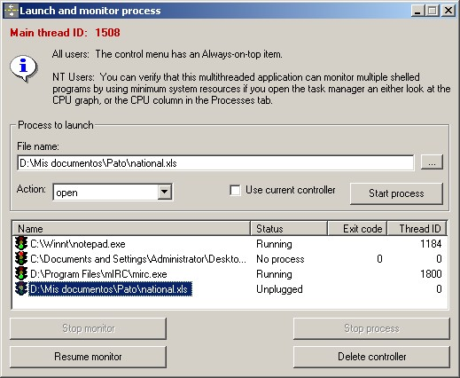



## Multithreading Programming

### Description

This article tries to give the reader an overview on how to properly synchronize multiple threads in a multithreaded program by using an example project that shells a process and waits for completion with optional abort.
 
### More Info
 

             |
---                |---
**Submitted On**   |2003-02-02 03:44:24
**By**             |[Jose Ramirez](https://github.com/Planet-Source-Code/PSCIndex/blob/master/ByAuthor/jose-ramirez.md)
**Level**          |Intermediate
**User Rating**    |5.0 (75 globes from 15 users)
**Compatibility**  |VB 5\.0, VB 6\.0
**Category**       |[Complete Applications](https://github.com/Planet-Source-Code/PSCIndex/blob/master/ByCategory/complete-applications__1-27.md)
**World**          |[Visual Basic](https://github.com/Planet-Source-Code/PSCIndex/blob/master/ByWorld/visual-basic.md)
**Archive File**   |[Multithrea153802222003\.zip](https://github.com/Planet-Source-Code/jose-ramirez-multithreading-programming__1-42880/archive/master.zip)

### Source Code

<h2>Introduction</h2>

This article intends to give a few pointers on how to correctly program Windows programs that create multiple threads. It contains an improved version of my first multithreaded program, <a href="http://www.planet-source-code.com/vb/scripts/ShowCode.asp?txtCodeId=42596&lngWId=1"><b>Multithreading to monitor shelled process</b></a>. As you can see in the screenshot, this program is capable of launching and monitoring any number of processes, provided you have enough system resources. It also exceeds the first version because this version uses a class to handle the threads, as oposed to the procedural approach seen in my first program.

<h3>NOTES:</h3>

<b>1.</b> The present code only works if compiled under Visual Basic 5.0 SP2 or SP3 because the VB6 runtime files are just a mess. To make it work under VB 6.0, you need to "initialize" the thread, as nicely exposed by a fiew submissions here at www.pscode.com. <a href="http://www.planet-source-code.com/vb/scripts/ShowCode.asp?txtCodeId=36373&lngWId=1">Click here</a> for an example. I will be updating this post with a working VB6.0 code in a couple of days. In the meantime, VB6ers can see the program running by renaming the file ThreadClass.exd to ThreadClass.exe and running it.

<b>2.</b> Whenever possible, I add hyperlinks to MSDN online where you can find information on a particular topic, like the definition of a critical section. If you are unfamiliar with synchronization objects, you will find the hyperlinks most useful.

<b>3.</b> Special thanks to Vlad Vissoultchev for clearing me a doubt about the type library issue.

<h2>Successfully Integrate Multithreading in an Application</h2>

As a Visual Basic programmer, you may think the main problem with multiple threads in Visual Basic is make it create the thread, especially Visual Basic 6 users. Well, that actually is the easiest part.

In any language, namely Visual Basic, Java, C++, C, etc., you will encounter problems when multithreading if you are not careful. For example, see bibliographic reference [1], the three message boxes example. The main thread completely disregards the existence of the other threads, and the result is the unexpected child thread termination after dismissing the main thread's message box.

Of course, the example posed is very simple and does not make the application crash, so it does not seem to be a big deal, but in real useful applications it is deadly. This is why you must <i>ALWAYS</i> synchronize your threads, at least to wait for child thread termination before you terminate the main thread (aka the process).

<h3>Critical Sections in ThreadClass.exe</h3>

As you can see from the code in ThreadExe.cls, there is a lot of synchronization code just for a simple task like waiting for an external process to finish. Every line has a reason. Keep reading.

First of all, the creation of a threaded class like ThreadExe requires careful planning. As a fundamental step, you need to identify all the variables and objects that will be accessed by more than one thread. If you find out that there is an object that is expected to run in a single thread, then you can safely ignore the addition of synchronization code in such object. And why? Because threads are self-synchronizing. In this project, the main thread is the user interface, and therefore, all user-interface components belong to this thread. But there are some elements of the user interface that need to be accessed by the other threads. These are: The listview and the command buttons that operate on the listview items. Also, the ThreadExe class will be accessed by the thread it created, and the main thread (the main thread can ask for ThreadID while the child thread is still running). This makes things particularly difficult in the design because you must ensure that the critical sections you access from one thread must be available or will be available without deadlocking. Deadlock is when thread A waits on thread B, but thread B is already waiting on thread A, effectively freezing the application.

If you browse the file ThreadExe.cls, you will note that there are two groups of member variables (private variables in the General declarations section): Member variables, and Control variables. Furthermore, there are two <a href="http://msdn.microsoft.com/library/default.asp?url=/library/en-us/dllproc/base/critical_section_objects.asp">critical sections</a>, one for accessing the member variables, and one for accessing the control variables. I implemented this model to avoid deadlocking. By design, the control variables represent the "control panel" for the thread. These variables signal the child thread (worker thread is a more accurate term) when to abort monitoring the process, or if the process should be killed, as well as when to raise the only event supported by ThreadExe, the StatusChanged method.

The other set of variables, the member variables, are the variables used to maintain the class data, like the filename being shelled out, the parameters, the show mode, the worker thread ID, etc. This is the kind of information the main thread is interested in. So, normally, whenever the main thread calls for methods in ThreadExe, the main thread must gain control over the critical section g_MemberVarsCS, which is normally not accessed by the worker thread. You can check the code in ThreadExe.StartMonitor to verify this, and while you are at it, note that there is no call to RaiseStatusEvent inside a pair of "EnterCriticalSection g_MemberVarsCS/LeaveCriticalSection g_MemberVarsCS" calls because it may deadlock the application. Why? There is also a critical section protecting the listview and the command buttons, and RaiseStatusEvent will eventually request ownership on that critical section, but the main thread may own it while requesting access to g_MemberVarsCS, ending in a deadlock. This is why the raising of the status event must only be done if g_MemberVarsCS is not owned.

<h3>Event Objects are Triggers</h3>

You will notice that ThreadExe uses an <a href="http://msdn.microsoft.com/library/default.asp?url=/library/en-us/dllproc/base/event_objects.asp">event object</a>. You can also see that the handle variable is a control variable. This event is used as a trigger to notify the worker thread that there has been at least one modification in the values of the control variables, and that immediate action is requested.

This is how the event object works in ThreadExe: The worker thread procedure (StartMonitor method) waits on two objects indefinitely using the <a href="http://msdn.microsoft.com/library/default.asp?url=/library/en-us/dllproc/base/waitformultipleobjects.asp">WaitForMultipleObjects</a> API function. The first object is the event object to signal a change in the control variables, hEventAccessControlVars, and the second is the process handle obtained via <a href="http://msdn.microsoft.com/library/default.asp?url=/library/en-us/shellcc/platform/shell/reference/functions/shellexecuteex.asp">ShellExecuteEx</a>:

<code>EnterCriticalSection g_MemberVarsCS 
bProcessOnMonitor = True 
arrObjects(1) = hEventAccessControlVars 
arrObjects(2) = m_hProcess 
LeaveCriticalSection g_MemberVarsCS 
RaiseStatusEvent 
Do 
&nbsp;&nbsp;&nbsp;&nbsp;lResp = WaitForMultipleObjects(2, arrObjects(1), 0, INFINITE) 
&nbsp;&nbsp;&nbsp;&nbsp;......</code>

This means that the worker thread will resume execution if A. hEventAccessControlVars is signaled using <a href="http://msdn.microsoft.com/library/default.asp?url=/library/en-us/dllproc/base/setevent.asp">SetEvent</a>, or B. If the shelled process ends. This is exactly the behavior I am looking for: If the process ends, fine, resume execution, and if I want to terminate the monitor all that is needed is enter the control variables' critical section, set bStopMonitor to True, leave the critical section, signal (or set) the event and wait for the worker thread to end. The latter description corresponds to the StopMonitor method in ThreadExe.

Summarizing, to synchronize threads is an enormous task that requires careful examination and planning, and even with proper designs and ideas you will find yourself restarting the Visual Basic IDE a lot, so you better save your project before testing it.

<h2>ThreadExe Usage</h2>

After all this explanation, you may be wanting to know how to use ThreadExe. Well, the actual usage of this class is very simple. Allow me to explain.

If you want to shell a process and wait for its completion, you create a new ThreadExe object:

<code>Dim oThread as ThreadExe 
 
Set oThread = New ThreadExe</code>

Now you need to pass the information about the filename you want to shell. It can be an executable file, or a document file:

<code>oThread.ExeName = "C:\Winnt\Notepad.exe"</code>

If you need to pass parameters, or the working directory, use the Parameters and Directory properties. Finally, you must specify the action you want:

<code>oThread.Action = "open"</code>

Now you are ready to shell the process. But wait, you won't receive notifications unless you specify a sink object. The normal way is to make the form implement the sink interface. In the form's general declarations type:

<code>Implements IThreadEvents</code>

Then, you can write your code for the StatusChanged event, and of course, set the sink for the thread object:

<code>Set oThread.EventSink = Me</code>

Now you can shell the process. Just call for the StartProcess method:

<code>If Not (oThread.StartProcess) Then 
&nbsp;&nbsp;&nbsp;&nbsp;MsgBox "Could not shell out the process!", vbExclamation 
End If</code>

To stop the monitor, you call for StopMonitor, and to resume monitoring, you use LaunchMonitor:
<code>oThread.StopMonitor 
 
oThread.LaunchMonitor</code>

Feel free to test and modify the provided code to fit your needs or just learn from it.

<h2>Freebies</h2>

The sample project shows a couple of nice features, not related to multithreading and that the reader may find useful or interesting.

<h3>Modified Control Menu</h3>

The main form, Form1, is subclassed to handle a new menu item in the control box's menu: Always on top. The standard module ModAlwaysOnTop contains all the necessary code for the addition and manipulation of this new element.

<h3>Load OEM Resources</h3>

There are lots of OEM resources available to the programmer. For example, have you ever wanted to use the information icon shown in the Message box form when you use the vbInformation enum value? Well, that is very simple to achieve. The Form_Load event of Form1 shows how to do it, and shows how to make a picture object out of a picture handle. For easy check, I reproduce the code here:

<code>&nbsp;&nbsp;&nbsp;&nbsp;hPic = LoadImage(0, OIC_INFORMATION, IMAGE_ICON, 16, 16, LR_DEFAULTCOLOR Or LR_SHARED) 
&nbsp;&nbsp;&nbsp;&nbsp;If (hPic <> 0) Then 
&nbsp;&nbsp;&nbsp;&nbsp;&nbsp;&nbsp;&nbsp;&nbsp;With IID_IPicture 
&nbsp;&nbsp;&nbsp;&nbsp;&nbsp;&nbsp;&nbsp;&nbsp;&nbsp;&nbsp;&nbsp;&nbsp;.Data1 = &H7BF80980 
&nbsp;&nbsp;&nbsp;&nbsp;&nbsp;&nbsp;&nbsp;&nbsp;&nbsp;&nbsp;&nbsp;&nbsp;.Data2 = &HBF32 
&nbsp;&nbsp;&nbsp;&nbsp;&nbsp;&nbsp;&nbsp;&nbsp;&nbsp;&nbsp;&nbsp;&nbsp;.Data3 = &H101A 
&nbsp;&nbsp;&nbsp;&nbsp;&nbsp;&nbsp;&nbsp;&nbsp;&nbsp;&nbsp;&nbsp;&nbsp;.Data4(0) = &H8B 
&nbsp;&nbsp;&nbsp;&nbsp;&nbsp;&nbsp;&nbsp;&nbsp;&nbsp;&nbsp;&nbsp;&nbsp;.Data4(1) = &HBB 
&nbsp;&nbsp;&nbsp;&nbsp;&nbsp;&nbsp;&nbsp;&nbsp;&nbsp;&nbsp;&nbsp;&nbsp;.Data4(3) = &HAA 
&nbsp;&nbsp;&nbsp;&nbsp;&nbsp;&nbsp;&nbsp;&nbsp;&nbsp;&nbsp;&nbsp;&nbsp;.Data4(5) = &H30 
&nbsp;&nbsp;&nbsp;&nbsp;&nbsp;&nbsp;&nbsp;&nbsp;&nbsp;&nbsp;&nbsp;&nbsp;.Data4(6) = &HC 
&nbsp;&nbsp;&nbsp;&nbsp;&nbsp;&nbsp;&nbsp;&nbsp;&nbsp;&nbsp;&nbsp;&nbsp;.Data4(7) = &HAB 
&nbsp;&nbsp;&nbsp;&nbsp;&nbsp;&nbsp;&nbsp;&nbsp;End With 
&nbsp;&nbsp;&nbsp;&nbsp;&nbsp;&nbsp;&nbsp;&nbsp;pd.cbSizeofStruct = Len(pd) 
&nbsp;&nbsp;&nbsp;&nbsp;&nbsp;&nbsp;&nbsp;&nbsp;pd.hImage = hPic 
&nbsp;&nbsp;&nbsp;&nbsp;&nbsp;&nbsp;&nbsp;&nbsp;pd.picType = PICTYPE_ICON 
&nbsp;&nbsp;&nbsp;&nbsp;&nbsp;&nbsp;&nbsp;&nbsp;OleCreatePictureIndirect pd, VarPtr(IID_IPicture), 1, lpPicture 
&nbsp;&nbsp;&nbsp;&nbsp;&nbsp;&nbsp;&nbsp;&nbsp;Set imgInfo.Picture = lpPicture 
&nbsp;&nbsp;&nbsp;&nbsp;End If</code>
<h2>Bibliographic References</h2>

1. <a href="http://www.microsoft.com/msj/defaultframe.asp?page=/msj/0897/multithreading.htm&nav=/msj/0897/newnav.htm">Ingenious Ways to Implement Multiple Threads in Visual Basic 5.0</a>

2. <a href="http://www.planet-source-code.com/vb/scripts/ShowCode.asp?txtCodeId=36373&lngWId=1">Compact In-Process Multi-threading: A FolderWatcher with sample UI</a>

3. <a href="http://www.freevbcode.com/ShowCode.Asp?ID=1287">A Thread to Visual Basic: Multi-Threading In VB5 and VB6</a>

4. <a href="http://msdn.microsoft.com/library/default.asp?url=/library/en-us/dllproc/base/synchronization.asp">Synchronization</a>

